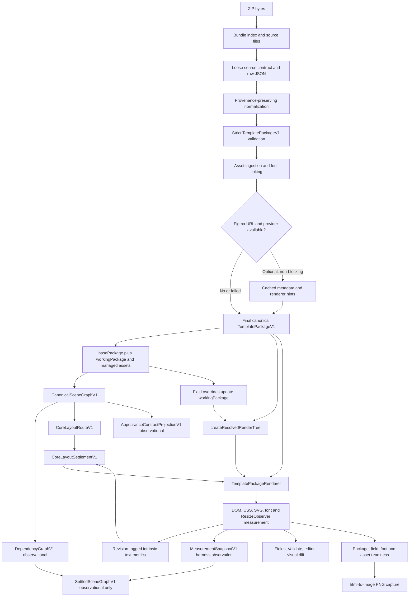

# Source-to-Render Data Flow

## Phase 13 internal rollout selection

The global internal rollout preference is not source data and never enters `TemplatePackageV1`:

`IndexedDB metadata -> ResolvedRendererRolloutPreferenceV1 -> ResolvedRendererRolloutDecisionV1(ResolvedBackendDecisionV1[]) -> effective resolved tree -> TemplatePackageRenderer`

Missing or invalid metadata leaves the original resolved tree and current per-surface runtime default unchanged. PNG capture binds to the resulting rollout identity. Persistence and reload reconstruct package semantics from saved ZIP state and select rollout ownership from a separate versioned control record.

The implemented Stage 1 cohort flow is:

`existing lifecycle + backend + diagnostic + readiness + local fidelity summaries -> RendererRolloutEligibilityV1 -> local RendererRolloutObservationV1 -> manual RendererRolloutCohortDecisionV1 -> existing rollout preference`

`renderer-rollout-cohort-store-v1` lives in IndexedDB operational metadata, not in `TemplatePackageV1`, templates, or drafts. The pure evaluator consumes current lifecycle/backend/diagnostic/readiness identities and explicit local evidence events. It may authorize a request for an existing mode only after current evidence; it cannot modify source, canonical, resolved, backend, or pixel authority. Incidents preserve history and use the existing Legacy rollback path. No remote telemetry edge exists.

## Phase 11–12 orchestration insertion

`resolved family contracts -> ResolvedBackendDecisionV1 per node -> backendDecisionRevision -> ResolvedBackendDiagnosticProjectionV1 -> renderer owner gates + quality workspace`

The insertion consolidates owner selection without replacing source normalization, canonical semantics, family resolution, settlement, or pixel backends. Canvas/offscreen and WebGL remain explicit unavailable tree-level boundaries. Persisted `workingPackage` reconstructs the same decisions offline; no renderer-time provider request participates.

## Milestone 7.4 ordered-SOLID branch

`ZIP ordered SOLID fills -> source normalization + solid-paint-source-v1 provenance -> strict TemplatePackageV1 -> CanonicalSceneGraphV1 -> PrimitiveAppearanceV1 -> ResolvedOrderedSolidStackV1 + current settled bounds/corners -> one SVG group/shared clip -> Validate / Fields / editor / shared previews / hidden PNG`

Source index 0 paints first and increasing indices paint forward with source-over. Hidden entries remain resolved but emit no layer. Canonical color alpha and paint opacity are applied once. A change to paint order/value/visibility/blend, bounds, corners, or canonical source changes the relevant revision. Mixed paints, ambiguous provenance, node opacity, masks, effects, strokes, media/vector ownership, invalid data, or unsupported geometry select whole-primitive compatibility.

## Milestone 7.3A linear-gradient branch

`ZIP canonical fill + extensions.figma.rawFills[sourceIndex] -> source-index normalization/provenance -> strict TemplatePackageV1 -> PrimitiveAppearanceV1 -> ResolvedLinearGradientGeometryV1 -> current settled bounds -> one SVG definition/path -> Validate / Fields / editor / shared previews / hidden PNG`

The raw matrix maps normalized node-local to normalized gradient coordinates and is inverted once. Stops, stop alpha, and paint opacity remain separate. Resize preserves normalized intent and recomputes the SVG user-space transform. Missing/conflicting source evidence, invalid matrices/stops, mixed paints, strokes, masks, effects, blends, media/vector owners, or unsupported geometry select the whole compatibility boundary. A stale resolved source revision is not rendered.

## Milestone 7 mask branch

`ZIP template.json node.mask + maskRelationships -> strict TemplatePackageV1 -> semantic relationship validation -> CanonicalSceneGraphV1 source/provenance/paint role -> ResolvedRenderTreeV1 capability/revision/clip -> current-revision renderer -> one affected-sibling CSS clip -> Validate / Fields / editor / PNG`

The branch is active only for exporter-declared scope. The exact opaque rectangular ALPHA subset has one derived clip owner and one `mask-input` paint owner. Invalid, incomplete, partial-alpha, luminance, vector/nested, effect, gradient, image-paint, or transformed sources preserve data and select explicit compatibility. Browser layout and pixels never infer a mask range. Renderer-time Figma access is absent.

## Milestones 7.1–7.2 primitive branch

`ZIP paints/strokes/bounds/radii -> source normalization -> strict TemplatePackageV1 -> CanonicalSceneGraphV1 semantic appearance/provenance -> ResolvedRenderTreeV1 PrimitiveAppearanceV1 -> current settled geometry -> capability-selected DOM/CSS owner -> Validate / Fields / editor / shared previews / hidden PNG`

Source revision changes with semantic input; geometry revision changes with settled bounds, edge-local effective radii, stroke paths, or ancestor clip chain; paint and stroke entries keep independent revisions. Stale supplied primitive trees are recomputed before publication. The renderer may resize the resolved geometry contract but does not reconstruct appearance from measured DOM bounds. Uniform INSIDE selects DOM/CSS; independent INSIDE and eligible CENTER/OUTSIDE select one SVG owner. Save/reload uses persisted ZIP-derived state with no renderer-time Figma access.

## Main path

## Ownership transitions

| Transition | Input | Output | Information policy |
| --- | --- | --- | --- |
| ZIP -> source | ZIP bytes/files | `LoadedTemplatePackageSource` | Preserve raw JSON and file references |
| Source -> normalized | Exporter-shaped JSON | Canonical-shaped JSON | Record normalization diagnostics; preserve unsupported/raw values in extensions where implemented |
| Normalized -> canonical | JSON | strict `TemplatePackageV1` | Reject invalid canonical data; do not weaken schema |
| Canonical -> enriched | canonical package + optional provider result | revalidated package | ZIP remains usable when enrichment is absent/fails |
| Canonical -> persisted | final package + assets | saved record | `basePackage` preserves import; `workingPackage` carries edits |
| Canonical -> resolved | package | `ResolvedRenderTreeV1` | Derive render strategy, properties, assets, fields, diagnostics |
| Canonical -> scene | `workingPackage` | `CanonicalSceneGraphV1` | Pure deterministic semantic/provenance projection |
| Scene -> appearance contracts | canonical scene | broad observational V1 records plus bounded resolved primitive/linear-gradient projection | Retain order/source sufficiency; only real-fixture-backed capability subsets route |
| Scene -> core route | scene capabilities | `CoreLayoutRouteV1` | No identity conditions; unsupported flow selects coherent fallback |
| Scene + intrinsic text -> routed settlement | scene + current revision glyph/line metrics | `CoreLayoutSettlementV1` | Final routed geometry; stale inputs rejected |
| Scene + browser evidence -> settled observation | scene + dependency graph + revision-matched measurement snapshot | `SettledSceneGraphV1` | Pure bounded settlement; runtime routing disabled; unsupported inputs explicit |
| Resolved + canonical -> DOM | resolved nodes + source nodes | React DOM/SVG/CSS | Compatibility helpers still inspect raw Figma extensions |
| DOM -> settled pixels | CSS layout + measurements + decoded assets | browser render | Current settled state is local, not serialized into the resolved tree |
| DOM -> export | ready hidden editor renderer | PNG data URL | Capture at package canvas size, pixel ratio 1 |

## Feature path pattern

For each property, consult [feature trace](FEATURE_TRACE.md), [property authority](PROPERTY_AUTHORITY.md), and [duplicate interpretations](DUPLICATE_INTERPRETATIONS.md). A missing resolved representation does not imply data loss if raw/canonical metadata is preserved, but it does imply that current output support is incomplete.

## Offline guarantee

Once ZIP assets/fonts and optional enrichment results are persisted, rendering reads package and managed local data. Figma providers are not part of the renderer-time path. Remote asset URLs can still affect asset/export readiness when a package contains them; the deterministic contract requires resolving or diagnosing them before export.

The full Milestone 3 `SettledSceneGraphV1` branch remains observational. The smaller `CoreLayoutSettlementV1` is a production consumer for eligible geometry on every live surface. Milestone 5 appearance contracts remain observational and have no renderer edge. Milestone 6 combines resolved image intent with the current settled/compatibility slot in a pure placement resolver before native DOM sampling; it introduces no network or Canvas edge. For CROP, the normalized slot-to-source transform is inverted exactly once before CSS placement and then clipped at the slot. Milestone 6.1 keeps imported mode/transform immutable and adds revisioned active replacement state: upload → replacement Fill, user switch → Fill/Fit, reset → imported-source. Each transition changes the routing identity and invalidates placement/export readiness; older async file/decode work is rejected by field-operation revision. The pure scene transformer and core solver perform no DOM access, network work, font activation, or asset decoding; only explicit intrinsic measurement and asset readiness touch browser APIs.
